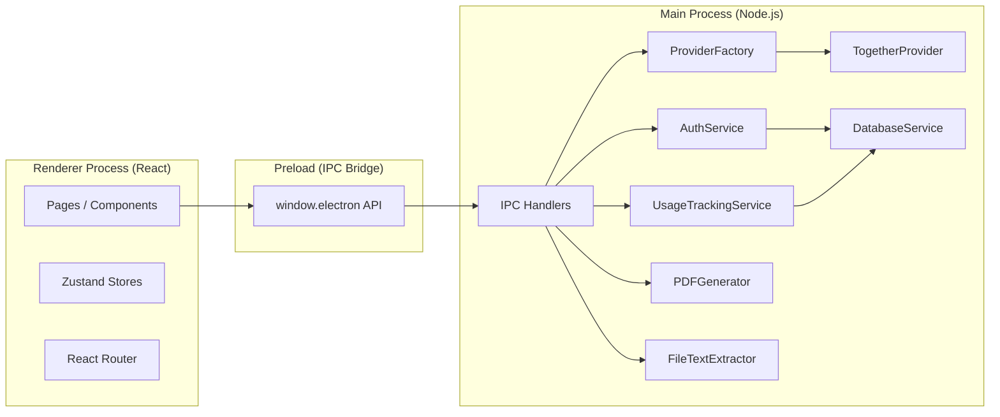

# Qreate

**Transform your study materials into realistic practice exams in minutes.**


## The Problem

Students study their notes, feel prepared, then freeze on the actual exam — because the experience of being tested is completely different from the experience of reviewing. Passive re-reading creates false confidence.

**Qreate solves this** by converting your notes or documents into professional, configurable practice exams. Upload a file, select question types and total question count, and get a formatted PDF in minutes — no ChatGPT cleanup, no formatting work, no manual question writing.

## Core Features

| Feature                  | Details                                                                                |
| ------------------------ | -------------------------------------------------------------------------------------- |
| AI exam generation       | Two-pass PFQS architecture: topic planning then question generation                    |
| File ingestion           | Drag-and-drop `.txt` and `.docx` upload                                                |
| Question types           | Multiple Choice, True/False, Fill in the Blanks, Short Answer                          |
| Difficulty orchestration | Five-level difficulty logic (Very Easy → Very Hard) is embedded in generation pipeline |
| PDF output               | Local generation via Electron's Chromium engine — no cloud needed                      |
| Exam history             | Personal exam library with metadata stored in SQLite                                   |
| Authentication           | Secure accounts with bcrypt hashing and session persistence                            |
| Quota system             | 10/week, 3/day burst, 40/month — automatic weekly reset                                |

## Demo

Demo GIF placeholder: `./docs/demo.gif`

Watch full demo (2 min): `link-here`

## Architecture



**Process isolation:** The renderer has no direct access to Node.js, filesystem, or AI providers. All privileged operations flow through the preload IPC bridge as named handlers.

## Technical Decisions

### Why Electron?

Desktop-first lets the app own PDF generation locally (via Chromium's print engine), read files from disk without upload friction, and manage SQLite-backed local accounts/sessions and exam history — all without a backend server or user account on an external service.

### Why Zustand?

Four focused stores (`useAppStore`, `useFileUploadStore`, `useExamConfigStore`, `useExamGenerationStore`) map directly to the four stages of the exam creation workflow. Zustand's minimal API keeps store logic readable with no boilerplate.

### Why two-pass generation?

Single-pass prompting forces the model to simultaneously plan topics, craft questions, balance difficulty, and distribute answer positions. In earlier baseline tests of the old single-pass flow, this caused repetition and shallow coverage. The two-pass PFQS architecture separates concerns:

- **Pass 1** (temperature 0.3, JSON mode): Extract unique concept assignments with Bloom's taxonomy levels and answer position targets. Zod-validated before proceeding.
- **Pass 2** (temperature 0.5, text mode): Generate one question per concept using the plan as a strict contract.

### Why Together AI + Groq fallback?

Together AI's serverless Qwen3-235B endpoint delivers the reasoning capacity needed for consistent multi-concept extraction. Groq (`llama-3.3-70b-versatile`) is wired as an automatic fallback via the same OpenAI-compatible SDK—no code path change, just a different `baseURL`. Both providers require only an API key; no model hosting or infrastructure needed.

### Why SQLite / better-sqlite3?

Synchronous SQLite is the correct choice for a single-user desktop app. No connection pooling, no async ORM overhead, no separate database process. `better-sqlite3` provides a clean typed API with zero native-module build issues on Windows.

## Production Notes

**API key placement:** The current architecture loads `TOGETHER_API_KEY` from `.env.local` in the main process. For a multi-user or web deployment, move provider calls to a hosted backend so API keys are never distributed with the installer.

**Migration path (desktop → hosted):**

1. Extract `TogetherProvider` + `ProviderFactory` into a standalone Express/Fastify service
2. Replace IPC handlers with `fetch()` calls to the hosted API
3. Move auth/session management to the hosted service
4. The renderer and preload bridge require minimal changes — only the IPC target changes

## Getting Started

### Prerequisites

- Node.js 18+
- npm

### Install

```bash
git clone https://github.com/j-dio/Qreate.git
cd Qreate
npm install
```

### Environment setup

```bash
cp .env.example .env.local
# Add your API keys — see .env.example for all options
```

**Together AI key (required):** [api.together.xyz/settings/api-keys](https://api.together.xyz/settings/api-keys)
**Groq key (optional fallback):** [console.groq.com/keys](https://console.groq.com/keys)

### Commands

```bash
npm run dev          # Start development (Electron + React hot reload)
npm run typecheck    # TypeScript type checking
npm run lint         # ESLint
npm run format       # Prettier
npm run build        # Production build
npm run package      # Create installer
```

## Tech Stack

| Category          | Technology                                                    |
| ----------------- | ------------------------------------------------------------- |
| Desktop framework | Electron 38                                                   |
| Frontend          | React 19, React Router 7, TypeScript 5.9                      |
| Styling           | Tailwind CSS 3.4                                              |
| State management  | Zustand 5                                                     |
| AI providers      | Together AI (Qwen3-235B), Groq (llama-3.3-70b) via OpenAI SDK |
| Database          | SQLite via better-sqlite3                                     |
| Authentication    | bcrypt, secure session tokens                                 |
| PDF generation    | Electron Chromium printToPDF                                  |
| File processing   | mammoth (.docx), Node.js fs (.txt)                            |
| Validation        | Zod                                                           |
| Build tooling     | electron-vite, Vite 7                                         |

## License

MIT — see [LICENSE](./LICENSE) for details.
